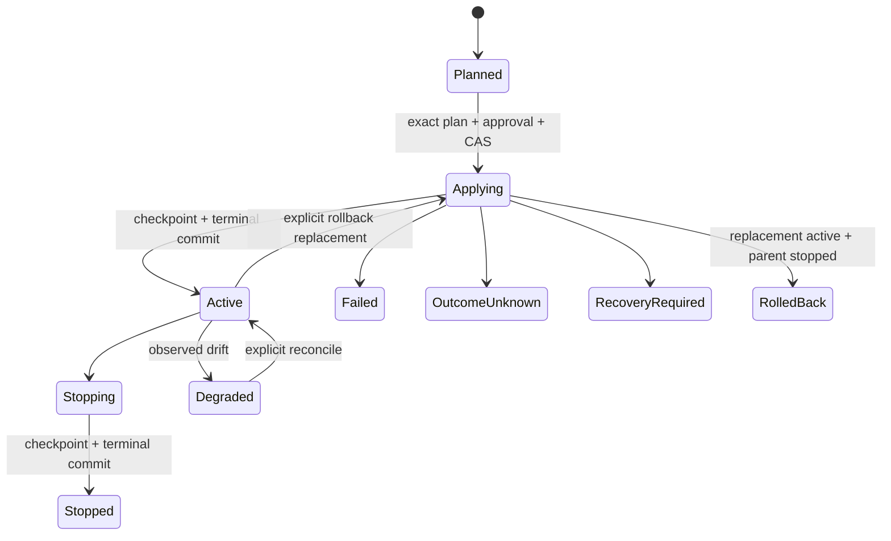

# Durable Realization Controller

> [English](./DURABLE_DEPLOYMENT_CONTROLLER.en.md) · [中文](./DURABLE_DEPLOYMENT_CONTROLLER.md)

Status: **Phase 6 Candidate implementation**. This page describes the durable controller behind `host.realization.*`. It is Host-owned mutable authority, not Constitutional Substrate and not a Project, old Composition, or Deployment identity. Old build-deploy, Installation-deployment, and ChangeSet-deployment routes were removed with no aliases; target/exec/port/proxy remain low-level Host adapters only.

## Invariants

- `RealizationPlan` is a pure content-addressed compilation result; planning invokes no Target effect.
- `RealizationRevision` is a mutable Host-control-journal projection; the public Runtime journal receives only redacted lifecycle relays.
- Apply/stop/rollback/reconcile revalidate the Host owner lease, current grant, exact resources, revision, and plan preconditions before every new effect.
- Journal replay rebuilds projection/continuation and never means external-effect replay.
- Local Docker and remote Target Agent use the same typed operation, fencing, idempotency, and receipt semantics.
- Run, Exposure/Binding, and Realization are independent lifecycles; none implicitly creates, applies, stops, or rebinds another.

## Records

```text
OperationalIntent (portable Work ref)
TargetInventorySnapshot (Host-observed artifact)
RealizationPlan (content-addressed pure result)
  work_revision / assembly_lock / operational_intent / inventory
  build_actions / launch_actions / state_actions / endpoint_actions
  placements / transports / preconditions / required_authority / risk_summary

RealizationRevision (Host projection)
  realization_id / parent_realization_id?
  installation_id / target_id / revision
  plan_ref / plan_digest / status
  actual_resources[] / receipt_refs[] / health
  created_at / updated_at
```

Plan and receipt artifacts enter the ObjectStore; the journal stores references and typed lifecycle facts. Credentials, raw secrets, absolute paths, raw stderr, and live-Workspace content never enter public records/events.

## Planner

The planner pins the current Installation revision, WorkRevision, AssemblyLock, OperationalIntent, and TargetInventorySnapshot. Identical canonical inputs produce identical plan bytes/digests. It accepts only execution classes allowed by the Intent and advertised by inventory. Missing artifacts/bindings/capabilities, offline Targets, insufficient resources, or approval requirements become structured gaps; there is no automatic Target fallback or publisher ordering.

`host.realization.plan` may persist immutable artifacts and a Planned revision, but driver-effect count remains zero.

## Apply state machine



Apply consumes a persisted `plan_ref` only. Approval binds the exact plan digest, expiry, and every risk acceptance. The request also pins expected revision and idempotency key: same key/fingerprint replays, while another fingerprint conflicts. Control-journal CAS plus the Host owner lease fences active-changing operations per Installation × Target.

## Effect checkpoints

An external system and the Host journal cannot form one database transaction. After an external effect succeeds and before a public terminal, the controller writes a Host-private checkpoint:

```text
host-private/realization.effect-applied
host-private/realization.effect-stopped
host-private/realization.stopping
```

A checkpoint carries stable action/request digests, observed resources, and structured receipt facts. It is not one of the 76 public platform events and never enters Runtime journal/SSE.

- Applying plus apply checkpoint: hydrate/same-key retry materializes receipts and commits Active without applying again.
- Stopping plus stop checkpoint: commit Stopped without stopping again.
- A checkpointed rollback replacement with parent-stop failure resumes parent stop without reapplying the replacement.
- Applying without a checkpoint becomes `recovery_required` on restart; the controller does not guess effect outcome.
- If the control journal also fails after an external effect, return `outcome_unknown` for explicit reconciliation; never fabricate a terminal.

## Executor

The first backend supports immutable OCI images and Dockerfile builds. Build produces a content-addressed image before launch. Typed Target receipts provide actual loopback ports, routes, and container/workload identity for `actual_resources`. Agent and local drivers validate Target identity, lease/policy epoch, operation/step/request digest, Installation ownership, and artifact digests. Unknown operations have no shell fallback.

Host routes default to `host_authenticated`; only an explicitly planned and approved public policy publishes one. Target-side listeners remain loopback-only, and remote traffic uses the authenticated reverse tunnel.

## Stop, rollback, and reconcile

- Stop acts only on persisted `actual_resources`, writing stopping intent before checked effect/checkpoint and public Stopped.
- Rollback reads a historic persisted plan and a new exact approval, creating a new RealizationId. It never reads a live Workspace, refetches source, or mutates history.
- Reconcile observes typed Target truth and updates health/resources/receipts without reapplying.
- Offline/unavailable observation is not interpreted as absence; `outcome_unknown` / `recovery_required` remains explicit.

## Public contract

| Method | Action | Exact resources |
|---|---|---|
| `host.realization.plan` | `realization.plan` | Installation + Target |
| `host.realization.get/list` | `observe` | visible Installation + Realization; list may filter by Target |
| `host.realization.apply/stop/reconcile` | `realization.apply` | Installation + Target + Realization |
| `host.realization.rollback` | `realization.apply` | Installation + Target + current + historic Realization |

The seven public events are planned/applying/active/stopped/failed/rolled_back/reconciled. Private checkpoints, grant basis, and effect continuation are not public. Old `host.deployment.*` methods do not exist and have no compatibility aliases.

## Completion gate

- deterministic, effect-free planning;
- zero effects for stale/revoked authority, revision, or approval;
- crash convergence between every effect/terminal boundary without duplicate effects;
- stop/rollback/reconcile consume persisted plans/resources only;
- semantically equivalent receipts from local and Agent drivers;
- Web, PWA, and CLI use public `host.realization.*` only, and UI closure never stops;
- public events/schema/SDK/conformance remain aligned to one registry source.

See [`../guides/REALIZATION.en.md`](../guides/REALIZATION.en.md) for product usage and [`TARGET_AGENT_PROTOCOL.en.md`](TARGET_AGENT_PROTOCOL.en.md) for Target wire semantics.
