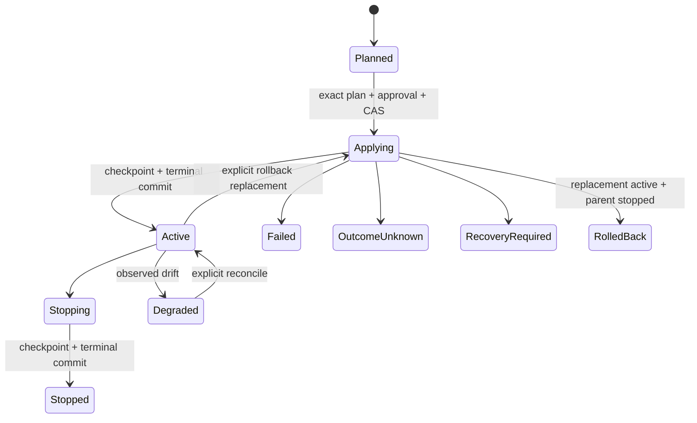

# 可恢复 Realization 控制器

> [English](./DURABLE_DEPLOYMENT_CONTROLLER.en.md) · [中文](./DURABLE_DEPLOYMENT_CONTROLLER.md)

状态：**Phase 6 Candidate 实现**。本页记录 `host.realization.*` 背后的 durable controller。它是 Host-owned mutable authority，不是 Constitutional Substrate，也不是 Project、old Composition 或 Deployment identity。旧 build-deploy、Installation-deployment 与 ChangeSet-deployment 路由已删除且没有 alias；target/exec/port/proxy 只保留为底层 Host adapter。

## 不变量

- `RealizationPlan` 是纯、content-addressed 编译产物；plan 不调用 Target effect。
- `RealizationRevision` 是 Host control journal 的 mutable projection；公开 Runtime journal 只接收经过脱敏的 lifecycle relay。
- apply/stop/rollback/reconcile 在每个新 effect 前重新验证 Host owner lease、当前 grant、exact resources、revision 与 plan precondition。
- journal replay 只重建 projection/continuation，不等于重做外部 effect。
- local Docker 与 remote Target Agent 使用同一 typed operation、fencing、idempotency 与 receipt 语义。
- Run、Exposure/Binding 与 Realization 是独立 lifecycle；任何一个都不能隐式创建、apply、stop 或 rebind 另一个。

## Records

```text
OperationalIntent (portable Work ref)
TargetInventorySnapshot (Host-observed artifact)
RealizationPlan (content-addressed pure result)
  work_revision / assembly_lock / operational_intent / inventory
  build_actions / launch_actions / state_actions / endpoint_actions
  placements / transports / preconditions / required_authority / risk_summary

RealizationRevision (Host projection)
  realization_id / parent_realization_id?
  installation_id / target_id / revision
  plan_ref / plan_digest / status
  actual_resources[] / receipt_refs[] / health
  created_at / updated_at
```

Plan 与 receipt artifact 进入 ObjectStore；journal 保存 refs 与 typed lifecycle facts。Credential、raw secret、绝对路径、raw stderr 与 live workspace 内容不进入公开 record/event。

## Planner

Planner 的输入固定 current Installation revision、WorkRevision、AssemblyLock、OperationalIntent 与 TargetInventorySnapshot。相同 canonical 输入产生相同 plan bytes/digest。它只接受 Intent 允许且 inventory 明确提供的 execution class；缺失 artifact/binding/capability、离线 Target、资源不足或 approval requirement 形成结构化 gap，不自动选择另一个 Target 或按 publisher 排序。

`host.realization.plan` 可以持久化 immutable artifacts 与 Planned revision，但 driver effect 计数必须保持零。

## Apply 状态机



Apply 只能消费 persisted `plan_ref`，approval 必须绑定 exact plan digest、有效期与每一项 risk acceptance。请求还固定 expected revision 与 idempotency key；同 key 同 fingerprint 重放，另一 fingerprint 冲突。一个 Installation × Target 的 active-changing operation 由 control journal CAS 与 Host owner lease fencing。

## Effect checkpoint

外部 effect 与 Host journal 无法成为单一数据库事务。控制器因此在外部 effect 成功后、公开 terminal 前写 Host-private checkpoint：

```text
host-private/realization.effect-applied
host-private/realization.effect-stopped
host-private/realization.stopping
```

Checkpoint 携带 stable action/request digest、observed resource 与结构化 receipt facts。它不属于 76 个 public platform event，也不进入 Runtime journal/SSE。

- Applying + apply checkpoint：hydrate/same-key retry 只物化 receipt 并提交 Active，不重复 apply。
- Stopping + stop checkpoint：只提交 Stopped，不重复 stop。
- rollback replacement checkpoint 已存在而 parent stop 失败：继续 parent stop，不重新 apply replacement。
- Applying 没有 checkpoint：重启后进入 `recovery_required`，不猜测 effect 成败。
- 外部 effect 后连 control journal 也不可写：返回 `outcome_unknown`，等待显式 reconcile；不能伪造 terminal。

## Executor

首个 backend 支持 immutable OCI image 与 Dockerfile build。Build 先产生 content-addressed image；launch 使用 typed Target operation；实际 loopback port、route、container/workload identity 只从 receipt 进入 `actual_resources`。Agent 与 local driver 都校验 Target identity、lease/policy epoch、operation/step/request digest、Installation ownership 与 artifact digests，未知 operation 没有 shell fallback。

Host route 默认 `host_authenticated`；只有 plan/approval 明确选择 public policy 才公开。Target 端只绑定 loopback；remote traffic 经 authenticated reverse tunnel。

## Stop、rollback 与 reconcile

- stop 只作用于当前 revision 的 persisted `actual_resources`，先 stopping intent，再 checked effect/checkpoint，最后公开 Stopped。
- rollback 读取 historic persisted plan 和新的 exact approval，创建新 RealizationId；不读取 live Workspace、不重新抓取源码，也不修改历史 revision。
- reconcile 只观察 typed Target truth 并更新 health/resources/receipts；它不重新 apply。
- Target offline/observation unavailable 不解释为资源不存在；保留 `outcome_unknown` / `recovery_required`。

## Public contract

| Method | Action | Exact resources |
|---|---|---|
| `host.realization.plan` | `realization.plan` | Installation + Target |
| `host.realization.get/list` | `observe` | visible Installation + Realization；list 可按 Target 过滤 |
| `host.realization.apply/stop/reconcile` | `realization.apply` | Installation + Target + Realization |
| `host.realization.rollback` | `realization.apply` | Installation + Target + current + historic Realization |

公开事件是 `planned/applying/active/stopped/failed/rolled_back/reconciled` 七种。Private checkpoint、grant basis 与 effect continuation 不公开。旧 `host.deployment.*` 不存在，也没有 compatibility alias。

## Completion gate

- planner deterministic 且 effect-free；
- authority/revision/approval stale 或被撤销时 effect 为零；
- 每个 effect/terminal 间 crash 可从 checkpoint 收敛且不重复 effect；
- stop/rollback/reconcile 只消费 persisted plan/resources；
- local 与 Agent driver 产生同语义 receipt；
- Web、PWA、CLI 只用 public `host.realization.*`，关闭 UI 不 stop；
- public events/schema/SDK/conformance 与 registry 单一事实源一致。

产品使用说明见 [`../guides/REALIZATION.md`](../guides/REALIZATION.md)，Target wire 见 [`TARGET_AGENT_PROTOCOL.md`](TARGET_AGENT_PROTOCOL.md)。
