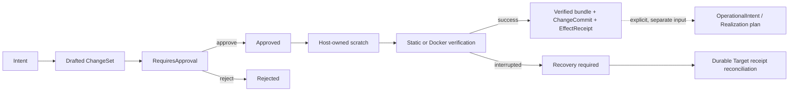

# Host Development Control Plane

> [English](./HOST_DEVELOPMENT_CONTROL_PLANE.en.md) · [中文](./HOST_DEVELOPMENT_CONTROL_PLANE.md)

Status: **Implemented**. The Host development control plane separates proposing a source change for a managed Workspace or Installation from executing managed resources. Source changes use the constitutional `Intent -> ChangeSet -> PolicyDecision -> ChangeCommit -> EffectReceipt` sequence; resource planning and execution use `host.realization.*` only. There is no arbitrary Host shell or first-party private bypass.

`plurora/workspace-lab` remains an ordinary planning Package with no execution authority. Real changes enter through the Host-authenticated `/host/v1/development/:subject_kind/:subject_id/changes` API, whose subject is `workspace` or `installation`. Docker verification runs as a durable Target operation. Success produces immutable artifacts and never implicitly applies a Realization, writes back a Workspace, or publishes a route.

## Lifecycle

Approval and execution are separate requests. Approval binds the exact server-returned operations, verification plan, `required_authority`, and `expected_effects`; ChangeSet content cannot be replaced afterward. A verified bundle is evidence for a later Work/OperationalIntent or explicit Realization plan and grants no Target effect authority.

## Host API

| Method | Route | Purpose |
|---|---|---|
| `GET` / `POST` | `/host/v1/development/:subject_kind/:subject_id/changes` | List / draft ChangeSets |
| `GET` | `/host/v1/development/:subject_kind/:subject_id/changes/:change_set_id` | Read state and durable refs |
| `GET` | `.../:change_set_id/bundle` | Export the artifact-backed JSON patch bundle |
| `POST` | `.../:change_set_id/approve` | Approve or reject the exact ChangeSet once |
| `POST` | `.../:change_set_id/execute` | Stage, verify, and produce an immutable verified bundle asynchronously |
| `POST` | `.../:change_set_id/recover` | Explicitly reconcile interrupted Docker verification |

A client needing managed resources invokes effect-free `host.realization.plan` from the Installation's OperationalIntent, presents the stable plan digest and risks, then uses a separate approval for `apply`; the development API exposes no parallel resource-execution lifecycle.

## Authority

- list/draft use `develop.propose` plus an exact Workspace/Installation selector;
- approve/reject use `develop.approve`;
- execute/recover use `develop.execute`;
- Realization inherits no development scope and separately requires `realization.plan` or `realization.apply` plus exact Installation, Target, and Realization resources;
- every durable/effect boundary revalidates the current grant, ancestors, expiry, and Host owner lease.

The root token remains the complete Host gate. Paired devices receive explicit grant subsets only, and unknown mutations fail closed. Authority is checked before and after blocking verification. A revoked or expired grant cannot begin a later effect; an in-flight effect is resolved through explicit recovery.

## Ownership behavior

| Workspace ownership | Draft | Scratch verification | Automatic write-back |
|---|---:|---:|---:|
| `managed` | Yes | Yes | No; produce an immutable verified bundle |
| `linked_local` | No | No | Never; explicitly import a managed copy first |

A linked-local directory is user-owned and may change concurrently. The Host neither copies it through a check-then-use path scheme nor deletes or rewrites user source. Managed Workspaces still avoid in-place multi-file transactions; verification always delivers a content-addressed bundle.

## File and artifact boundary

- Changes support typed `file_write` / `file_delete` only. Absolute paths, `..`, backslashes, VCS metadata, `.env`, credential files, and duplicate targets are rejected.
- Source input is limited to 4 MiB per file and 16 MiB per request; a Workspace is limited to 25,000 files, 25,000 directories, and 256 MiB. These are explicit current verifier limits, not universal platform quotas.
- Snapshot copy counts bytes actually read, checks file identity/size before and after opening, rejects hardlinks on Unix, and fails closed on symlinks or special files.
- Journals store structure, state, and artifact descriptors. Source bodies live in the content-addressed ObjectStore, and ChangeSets reject secrets.

## Verification boundary

`static_validation` checks scratch structure and the final tree digest without executing Workspace code. `docker_build` is the only current verifier that executes Workspace code:

- Dockerfile only, with no arbitrary command runner;
- context from a controlled Host-managed Workspace snapshot;
- `network=none` by default; `bridge` must be explicit in the ChangeSet and requires corresponding authority;
- no build secrets, Host mounts, or arbitrary environment injection;
- persist status, artifact refs, and a redacted diagnostic digest, never raw Docker logs;
- delete the verification image after ownership-label checks rather than implicitly promoting it to a managed workload.

## Durability and recovery

- Each Installation/Workspace subject uses an independent development journal session; transitions use `append_with_sequence_if_next` expected-tail CAS.
- ChangeSet ids derive deterministically from subject + idempotency key; another fingerprint using the same key conflicts.
- One Host owner lease fences the development controller. Lease loss prevents approval, execution, and new effects.
- Staging/static interruption can fail and clean scratch. Uncertain Docker effects become `recovery_required` / `outcome_unknown`, never an invented ordinary failure.
- Recovery reconciles durable Target operations and artifacts only. It does not replay arbitrary commands, read a live Workspace, or implicitly create a Realization.

## Deliberately absent

- arbitrary shell, install/test command, or Host command runner;
- automatic mutation of linked-local/native Workspaces;
- implicit use of a verification image in a Realization;
- a machine identity or API parallel to Work/Assembly/Installation/Realization;
- local CLI or first-party Package mutation paths that bypass the public Host API.

See [`../guides/REALIZATION.en.md`](../guides/REALIZATION.en.md) for the Realization lifecycle and [`HOST_RESOURCE_AUTHORITY.en.md`](HOST_RESOURCE_AUTHORITY.en.md) for device authority.

## Workspace operating plane

A Workspace is a Host-local mutable source location and is not part of Work identity.

- `managed`: a controlled copy under `<data>/workspaces/<workspace-id>/source/`.
- `linked_local`: a binding to a directory the user already has. The Host has no authority to delete that source. Linked-local sources are never deleted.

A repository without an explicit Work source is inspected statically first. It does not automatically install, build, or open the network. Real file effects must pass `Intent → ChangeSet → PolicyDecision → ChangeCommit → EffectReceipt`. Web and CLI use only the public Host API. Packing and Installation adoption are in [`../guides/INSTALLATION_MODEL.md`](../guides/INSTALLATION_MODEL.en.md).
