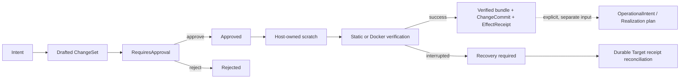

# Host 开发控制平面

> [English](./HOST_DEVELOPMENT_CONTROL_PLANE.en.md) · [中文](./HOST_DEVELOPMENT_CONTROL_PLANE.md)

状态：**Implemented**。Host 开发控制平面把“为 managed Workspace 或 Installation 提出源码变更”与“执行 managed resources”严格分开。源码变更使用宪法对象 `Intent -> ChangeSet -> PolicyDecision -> ChangeCommit -> EffectReceipt`；资源规划与执行只通过 `host.realization.*`，没有任意 Host shell 或第一方私有旁路。

`plurora/workspace-lab` 是普通、无执行权限的规划 Package。真实变更只能经受 Host 认证的 `/host/v1/development/:subject_kind/:subject_id/changes` API，subject 只允许 `workspace` 或 `installation`。Docker verification 作为持久化 Target operation 运行；验证成功产出不可变 artifact，不会隐式 apply Realization、写回 Workspace 或公开 route。

## 生命周期

审批与执行是两个请求。审批绑定服务端返回的 exact operations、verification plan、`required_authority` 与 `expected_effects`；批准后不能替换 ChangeSet 内容。Verified bundle 只是未来 Work/OperationalIntent 或显式 Realization planning 的输入证据，不授予 target effect。

## Host API

| Method | Route | 作用 |
|---|---|---|
| `GET` / `POST` | `/host/v1/development/:subject_kind/:subject_id/changes` | 列表 / 草拟 ChangeSet |
| `GET` | `/host/v1/development/:subject_kind/:subject_id/changes/:change_set_id` | 读取状态与 durable refs |
| `GET` | `.../:change_set_id/bundle` | 导出 artifact-backed JSON patch bundle |
| `POST` | `.../:change_set_id/approve` | 一次性批准或拒绝 exact ChangeSet |
| `POST` | `.../:change_set_id/execute` | 异步暂存、验证并生成 immutable verified bundle |
| `POST` | `.../:change_set_id/recover` | 显式对账中断的 Docker verification |

需要 managed resources 时，客户端从 Installation 的 OperationalIntent 调用 effect-free `host.realization.plan`，展示稳定 plan digest 与风险，再用独立 approval 调用 `apply`；development API 不提供并行的资源执行生命周期。

## Authority

- list/draft 使用 `develop.propose` 与 exact Workspace/Installation selector；
- approve/reject 使用 `develop.approve`；
- execute/recover 使用 `develop.execute`；
- Realization 不继承任何 development scope，分别要求 `realization.plan` 或 `realization.apply` 加 exact Installation、Target 与 Realization；
- 每个 durable/effect 边界重新验证当前 grant、祖先、expiry 与 Host owner lease。

Root token 仍是完整 Host 门禁。Paired device 只能获得显式 grant 子集；未知写操作 fail closed。阻塞验证开始前与完成后都重新检查 authority。已撤销或过期的 grant 不能启动后续 effect；已在途 effect 通过显式 recover 对账。

## 所有权行为

| Workspace ownership | 草拟 | scratch 验证 | 自动写回 |
|---|---:|---:|---:|
| `managed` | 是 | 是 | 否；产出不可变 verified bundle |
| `linked_local` | 否 | 否 | 永不；先显式导入 managed 副本 |

linked-local 是用户可并发修改的目录。Host 不用 check-then-use 路径方案复制它，也不删除或自动写用户源码。Managed Workspace 仍不做多文件原地事务；验证结果统一以 content-addressed bundle 交付。

## 文件与 artifact 边界

- 变更只支持类型化 `file_write` / `file_delete`；拒绝绝对路径、`..`、反斜杠、VCS metadata、`.env`、credential 文件与重复目标。
- 单文件输入最大 4 MiB，请求源码合计最大 16 MiB；Workspace 最大 25,000 文件、25,000 目录与 256 MiB。这些是现有验证器的明确实现上限，不是平台通用配额。
- snapshot 按实际读取字节计数，打开前后核对文件身份/大小，Unix 拒绝 hardlink；symlink 与特殊文件 fail closed。
- journal 只保存结构、状态与 artifact descriptor；源码正文进入 content-addressed ObjectStore。ChangeSet 不接受 secret。

## Verification 边界

`static_validation` 只检查 scratch 结构与最终 tree digest，不执行 Workspace 代码。`docker_build` 是当前唯一执行 Workspace 代码的 verifier：

- 只接受 Dockerfile，不调用任意 command runner；
- context 必须来自 Host-managed Workspace 的受控 snapshot；
- 默认 `network=none`，`bridge` 必须由 ChangeSet 显式声明并要求相应 authority；
- 不接受 build secret、host mount 或任意环境注入；
- 结果只持久化状态、artifact refs 与脱敏 diagnostic digest，不保存 raw Docker log；
- verification image 在 ownership labels 校验后删除，不被隐式提升为 managed workload。

## Durability 与恢复

- 每个 Installation/Workspace subject 使用独立 development journal session；transition 用 `append_with_sequence_if_next` 做 expected-tail CAS。
- ChangeSet id 从 subject + idempotency key 确定性派生；同 key 不同 fingerprint 冲突。
- Development controller 使用单一 Host owner lease；lease 丢失后不再批准、执行或产生新 effect。
- staging/static interruption 可失败并清理 scratch；Docker effect 不确定时进入 `recovery_required` / `outcome_unknown`，不能伪造成普通 failure。
- recover 只对账 durable Target operation 与 artifact，不重放任意命令，不读取 live Workspace，也不隐式创建 Realization。

## 刻意未提供

- arbitrary shell、install/test command 或 Host command runner；
- 自动修改 linked-local/native Workspace；
- 把 verification image 隐式用于 Realization；
- 与 Work/Assembly/Installation/Realization 并行的机器身份或 API；
- 绕过公开 Host API 的本地 CLI 或第一方 Package 写入路径。

Realization 生命周期见 [`../guides/REALIZATION.md`](../guides/REALIZATION.md)，设备授权见 [`HOST_RESOURCE_AUTHORITY.md`](HOST_RESOURCE_AUTHORITY.md)。

## Workspace 操作平面

Workspace 是 Host-local 可变源码位置，不进入 Work identity。

- `managed`：受控副本在 `<data>/workspaces/<workspace-id>/source/`。
- `linked_local`：指向用户已有目录；Host 没有删除该源的权威。linked-local source 永不删除。

没有显式 Work source 的仓库先做静态 inspection，不会自动 install / build / 联网。真实文件 effect 必须经过 `Intent → ChangeSet → PolicyDecision → ChangeCommit → EffectReceipt`。Web 与 CLI 只走公开 Host API。打包与 Installation 采用见 [`../guides/INSTALLATION_MODEL.md`](../guides/INSTALLATION_MODEL.md)。
