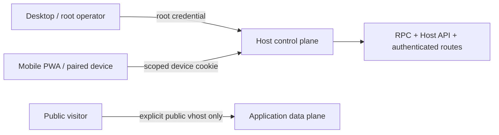

# Host Remote Access and Route Exposure

> [English](./HOST_REMOTE_ACCESS.en.md) · [中文](./HOST_REMOTE_ACCESS.md)

Web/PWA, Desktop, and CLI are clients of the same Host. Remote access creates no second mutation interface and never copies the root token to a phone. It places revocable, expiring device identities attenuated by actions and structured resources in front of the same Host API / RPC.

## Two planes



- The Host control plane manages Work, Workspace, Installation, Run, Target, Exposure, Binding, Realization, ChangeSets, and access grants.
- The application data plane bypasses Host authentication only after an explicit public Exposure / route; configuring a domain does not publish a service.
- `/pair` and static Web files contain no authority. Real reads and mutations remain behind protected APIs.

## Identities

| Identity | Credential | Purpose |
|---|---|---|
| Host root | Bearer from `PLURORA_HTTP_ACCESS_TOKEN` / `--access-token`; Desktop may exchange one-time bootstrap for a root cookie | Local management, initial authorization, recovery; every scope |
| Paired device | `plurora_access.*`; after PWA claim, only the `__Host-plurora_remote_session` Cookie | Only the scopes and selectors in its grant |

A non-loopback Host refuses startup without a non-empty root token. Root credentials never enter pairing URLs, browser persistence, application upstreams, or logs.

## Scopes

```text
observe
installation.manage
run
binding.manage
exposure.manage
realization.plan
realization.apply
develop.propose
develop.approve
develop.execute
access_manage
```

The old `deploy` scope was removed in Phase 6. An ordinary device planning or executing managed resources needs `realization.plan` or `realization.apply`, respectively, together with exact Installation, Target, and Realization selectors. Low-level target/exec/port/proxy adapters do not inherit those scopes.

Web invitations select only `observe` by default. Unknown HTTP paths, unknown RPC methods, and broad administration fail closed. New grants must be subsets of caller authority, and only root can delegate `access_manage`.

## Resource selectors

Kinds: `work`, `workspace`, `installation`, `run`, `target`, `exposure`, `binding`, and `realization`.

```json
{"kind":"installation","id":"018f2b74-..."}
{"kind":"installation","id":null}
```

A wildcard requires explicit `id: null`; omitting `id` rejects. Selectors compare structurally and exactly, never by string prefix, display name, or path inference.

The server validates or filters Installation list/get/update/remove, development subjects, target operations, and later Run/Exposure/Realization across HTTP and RPC. Device identities are never collapsed into unconstrained `HostDev` at `/rpc`. Caller-supplied `session_id`, `installation_id`, and `workspace_id` values are locators and still require current grants.

Child grants cannot exceed parent scopes, resources, or expiry. Authentication validates the complete delegation chain, so revoking or expiring an ancestor invalidates descendants immediately. Allow/deny decisions enter a redacted journal without tokens, Cookies, or raw request parameters.

## Pairing lifecycle

1. An `access_manage` client calls `POST /host/v1/access/pairings` with device name, scopes, selectors, and expiry.
2. Host returns a one-time high-entropy pairing token valid for at most ten minutes.
3. The new device removes the URL token, retains it in memory only, and inspects the invitation.
4. On confirmation, claim atomically consumes the pairing, creates a grant valid for at most 365 days, and sets a Secure, HttpOnly, SameSite=Strict, host-only Cookie.
5. Expiry or revoke fails the next authentication immediately; pending pairings can be cancelled before claim.

Pairing, claim, cancel, and revoke use EventStore compare-and-append. Only one concurrent claim succeeds. The journal stores domain-separated credential digests only.

## CLI

CLI uses the same Host API as Web/PWA and never writes the grant journal directly. Plain HTTP is loopback-only; remote Hosts require HTTPS, origins cannot contain paths or credentials, and requests do not follow redirects.

```bash
plurora host connection save workshop --endpoint https://host.example.com
plurora host access --access-token "$PLURORA_HTTP_ACCESS_TOKEN" me
plurora host access --access-token "$PLURORA_HTTP_ACCESS_TOKEN" \
  pair --device-name phone --scopes observe,installation.manage \
  --resource installation:<installation-id>
plurora host access --access-token "$PLURORA_HTTP_ACCESS_TOKEN" revoke <grant-id>
```

## Surface and application access

A sandboxed surface has an opaque origin and cannot carry Host Cookies or Bearer tokens. `host.surface.bundle.resolve` exchanges a protected Package bundle for a random, five-minute, read-only `/surface-assets/<lease>/...` URL bound to the grant and bundle root. The lease is not an RPC credential and expires on revoke or grant expiry.

Exposure defines endpoints and access policy. Realization compiles OperationalIntent into a persisted resource plan and executes it through typed Target operations. The low-level `host.proxy.*` adapter remains `host_authenticated` by default; only a user-approved `public` policy in the plan enables a public vhost. No old deployment-route alias remains.

Public applications own internet-input validation, application identity, CSRF, rate limiting, and content security. Host grants are not application user accounts.

## Deliberately absent

- automatic root-token synchronization to phones;
- local CLI writes that bypass the Host API;
- execution, public endpoints, or side-effect replay without explicit confirmation;
- ambient remote shells, arbitrary network proxies, or Host filesystem mounts;
- Host-supplied application login, public CORS, or edge protection.

See [`HOST_RESOURCE_AUTHORITY.md`](HOST_RESOURCE_AUTHORITY.en.md) for resource authorization details.
