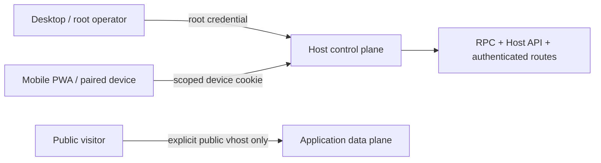

# Host 远程访问与路由暴露

> [English](./HOST_REMOTE_ACCESS.en.md) · [中文](./HOST_REMOTE_ACCESS.md)

Web/PWA、Desktop 与 CLI 是同一个 Host 的客户端。远程访问不会建立第二套写入接口，也不会把 root token 复制到手机；它在同一 Host API / RPC 前放置可撤销、可过期、按 action 与结构化资源衰减的设备身份。

## 两个平面



- Host 控制平面管理 Work、Workspace、Installation、Run、Target、Exposure、Binding、Realization、ChangeSet 与访问授权。
- 应用数据平面只有在显式公开 Exposure / route 后才绕过 Host 认证；配置域名本身不发布服务。
- `/pair` 和静态 Web 文件本身不含 authority；真正读写仍在受保护 API 后。

## 身份

| 身份 | 凭据 | 用途 |
|---|---|---|
| Host root | `PLURORA_HTTP_ACCESS_TOKEN` / `--access-token` Bearer；Desktop 可用一次性 bootstrap 换 root cookie | 本机管理、首次授权、恢复；拥有全部 scope |
| Paired device | `plurora_access.*`；PWA claim 后只存在 `__Host-plurora_remote_session` Cookie | 只拥有 grant 中列出的 scopes 与 selectors |

非 loopback Host 没有非空 root token 时拒绝启动。Root token 不进入 pairing URL、浏览器持久存储、应用上游或日志。

## Scope

```text
observe
installation.manage
run
binding.manage
exposure.manage
realization.plan
realization.apply
develop.propose
develop.approve
develop.execute
access_manage
```

普通设备若要规划或执行 managed resources，必须分别获得 `realization.plan` 或 `realization.apply`，并携带 exact Installation、Target 与 Realization selector。底层 target/exec/port/proxy adapter 不继承这些 scope。

Web 默认邀请只选 `observe`。未知 HTTP path、未知 RPC method 与宽泛管理变更 fail closed；新 grant 只能是调用者 authority 的子集，只有 root 可以转授 `access_manage`。

## Resource selector

资源 kind：`work`、`workspace`、`installation`、`run`、`target`、`exposure`、`binding`、`realization`。

```json
{"kind":"installation","id":"018f2b74-..."}
{"kind":"installation","id":null}
```

Wildcard 必须显式写 `id: null`；省略 `id` 会拒绝。Selector 只做结构化精确比较，不做字符串前缀匹配，也不从 display name 或路径推断 identity。

HTTP 与 RPC 在服务端校验或过滤 Installation list/get/update/remove、development subject、target operation 与后续 Run/Exposure/Realization。设备身份不会在 `/rpc` 被折叠成无约束 `HostDev`。调用方提供的 `session_id`、`installation_id` 或 `workspace_id` 只是定位符，仍需当前 grant。

子 grant 的 scope、resource、期限都不能超过父 grant；认证验证完整 delegation chain，撤销或过期任一祖先会立即使后代失效。Allow/deny decision 写入脱敏 journal，不记录 token、Cookie 或原始请求参数。

## Pairing 生命周期

1. `access_manage` 客户端调用 `POST /host/v1/access/pairings`，提交设备名、scope、selector 与期限。
2. Host 返回最多存活 10 分钟的一次性高熵 pairing token。
3. 新设备清除地址栏 token，只在内存保留，并先 inspect 邀请。
4. 用户确认后 claim 原子消费 pairing，创建最长 365 天 grant，并设置 Secure、HttpOnly、SameSite=Strict、host-only Cookie。
5. grant 过期或撤销后，下一次认证立即失败；pending pairing 可在领取前取消。

Pairing、claim、cancel 与 revoke 使用 EventStore compare-and-append；并发 claim 只有一个成功。Journal 只保存 domain-separated credential digest。

## CLI

CLI 使用和 Web/PWA 相同的 Host API，不直接读写 grant journal。明文 HTTP 只允许 loopback；远程 Host 必须 HTTPS，origin 不能包含路径或 credential，请求不跟随 redirect。

```bash
plurora host connection save workshop --endpoint https://host.example.com
plurora host access --access-token "$PLURORA_HTTP_ACCESS_TOKEN" me
plurora host access --access-token "$PLURORA_HTTP_ACCESS_TOKEN" \
  pair --device-name phone --scopes observe,installation.manage \
  --resource installation:<installation-id>
plurora host access --access-token "$PLURORA_HTTP_ACCESS_TOKEN" revoke <grant-id>
```

## Surface 与应用访问

Sandbox surface 是 opaque origin，不能携带 Host Cookie 或 Bearer。`host.surface.bundle.resolve` 把受保护 Package bundle 换成随机、五分钟、只读、绑定 grant 与 bundle root 的 `/surface-assets/<lease>/...` URL。Lease 不是 RPC credential，撤销或过期会失效。

Exposure 定义 endpoint 与 access policy；Realization 把 OperationalIntent 编译成持久化资源计划并通过 typed Target operation 执行。底层 `host.proxy.*` adapter 仍默认 `host_authenticated`；只有 plan 中经用户显式批准的 `public` policy 才允许 public vhost。

公开应用自行承担互联网输入、应用身份、CSRF、速率限制与内容安全。Host grant 不是应用用户系统。

## 刻意未提供

- root token 自动同步到手机；
- 本地 CLI 绕过 Host API 写入；
- 未经确认的执行、公开 endpoint 或副作用重放；
- ambient remote shell、任意网络代理或 Host filesystem mount；
- 代替应用实现登录、公开 CORS 或互联网边缘防护。

资源授权细节见 [`HOST_RESOURCE_AUTHORITY.md`](HOST_RESOURCE_AUTHORITY.md)。
